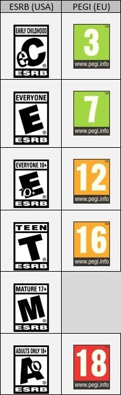

# 2022-2023 - PROJECT 2 - X86 RETROGAMING - TEAM 1

## Functional Specification

📖 Table of content

- [2022-2023 - PROJECT 2 - X86 RETROGAMING - TEAM 1](#2022-2023---project-2---x86-retrogaming---team-1)
  - [Functional Specification](#functional-specification)
  - [I. Overview](#i-overview)
    - [1. Project scope](#1-project-scope)
    - [2. Milestones](#2-milestones)
    - [3. The current state of Pac-Man](#3-the-current-state-of-pac-man)
      - [A. Yesterday](#a-yesterday)
      - [B. Today](#b-today)
      - [C. Tomorrow](#c-tomorrow)
  - [II. Requirements](#ii-requirements)
  - [III. Goals and constraints](#iii-goals-and-constraints)
  - [IV Non-functional requirements](#iv-non-functional-requirements)
  - [V. Personas and scenario](#v-personas-and-scenario)
    - [1. Hervé](#1-hervé)
    - [2. Jessica](#2-jessica)
    - [3. Vanessa](#3-vanessa)
  - [VI. Solution Overview](#vi-solution-overview)
  - [VII. Risk Mitigation](#vii-risk-mitigation)
  - [VIII. Security](#viii-security)
  - [IX. Cost estimation](#ix-cost-estimation)
    - [1. Software](#1-software)
    - [2. Hardware](#2-hardware)
    - [3. Human and Time](#3-human-and-time)
  - [X. Evaluation criteria](#x-evaluation-criteria)
  - [Project role distribution](#project-role-distribution)
  - [Glossary](#glossary)

| | |
| ----- | ----- |
| Author(s) | Grégory PAGNOUX |
| Reviewer(s) | Victor LEROY |
| Created on | 11/06/2023 |
| Last updated | 11/09/2023 |

## I. Overview

### 1. Project scope

[ALGOSUP](https://algosup.com)[^1] give the project to recreate a Pac-Man game[^2] with some twists while keeping the style of the original game, we will obviously have to get a working game before adding any changes. In order to get a better immersion, we will be using an emulator[^3] from 90's computer to run, display and play the game.

### 2. Milestones

| Date | Deliverable |
| :-: | :-: |
| 11/13/2023 | Functional Specification |
| 11/27/2023 | Technical Specification |
| 12/08/2023 | Test plan |
| 12/11/2023 | Working prototype |
| 12/21/2023 | Final Product |
| 12/22/2023 | Presentation |

### 3. The current state of Pac-Man

(explain PAC-MAN game)

#### A. Yesterday

Pac-Man is a game released during 1980, that was an immediate success. It is in the Top 5 of the best games from the 80's.
The game created by Tōru Iwatani[^4] was imagined for women because at this time, main players were men. For that, he implemented a game without stereotypes and with basic and neutral colors. There are also 4 ghosts including one feminal, smarter than the 3 others.

*Sources :* [Sens Critique](https://www.senscritique.com/top/resultats/les_meilleurs_jeux_video_des_annees_1980/558562) / [Janette](https://janette.lu/les-jeux-video-les-plus-emblematiques-des-annees-80/) / [Holy Gamer Z](https://www.holygamerz.com/fr/meilleurs-jeux-video-des-annees-80-quelques-noms-pour-se-rafraichir-la-memoire)

#### B. Today

It is still one of the most famous games in the world. Everyone knows the little yellow diagram and the colors of the four ghosts.
Today, we have many new games (last one is Pac-Man World Re-Pac released the 08/26/2022), a little animated serie composed of 44 episodes, and lots of by-products.

*Sources :* [Bandai Namco, new game](https://fr.bandainamcoent.eu/pac-man/infos/le-jeu-pac-man-world-re-pac-disponible-le-26-aout-2022) / [Wikipédia](https://en.wikipedia.org/wiki/Pac-Man_(TV_series)) / [Bandai Namco, by-product](https://store.bandainamcoent.eu/fr/games/brands/pac-man/?page=1)

#### C. Tomorrow

Pac-Man is the most bought game on the Atari 2600[^5], 9th on the Game Boy Advanced[^6], 3rd on mobile and is the best arcade selling. There is also Ms. Pac-Man which is the 5th most-selling arcade game.
Many new games keep getting released with tons of by-products, so Pac-Man will continue to exist for several decades.

*sources :* [Wikipédia](https://fr.wikipedia.org/wiki/Liste_des_jeux_vidéo_les_plus_vendus)

## II. Requirements

**Requirements :**

- Windows/MacOS
- DOSBox
- Assembly
- Recreate a Pac-Man game from 90's computer
- Improve the original game

## III. Goals and constraints

**Goals :**

- recreate the maze :
  - wall (blue)
  - road (black)
  - ghosts house
- Implement Pac-Man (yellow)
- implement key to move with Pac-Man
- Implement 4 ghosts :
  - Blinky (red)
  - Pinky (pink)
  - Inky (blue)
  - Clyde (Orange)
- implement random moves for ghosts
- point system :
  - small points = +50 (white)
  - big points = +200 (white)
- bonus :
  - cherry (red)
  - heart (purple)
- implement life system :
  - loose one life
  - gain one life
  - game over when life is zero
- display score
- display music
- display sounds :
  - eat points
  - eat ghost
  - ghost kill you
- create win page
- create home page :
  - play
  - exit
  - setting

**Constraints :**

- Programming language : Assembly[^7]
- Emulator : DOSBox[^8]
- 16-bit processor
- Respect Pac-Man style

## IV Non-functional requirements

There isn't a lot of non-functional requirements but those that exist are the following one:

- The game must keep the classic PAC-MAN feeling, even if we're allowed to improve it
- The game should be playable on a x86 emulator
- The game must not be subject to crashes or major bugs during execution.

## V. Personas and scenario

> **Target audience**

Pac-Man is a world-wide known game and built its place in the heart of a lot of players. Our product is therefore intended to men and women, young and old people, new player and nostalgic player. Pac-Man is a PEGI 3[^9] game and an Everyone ESRB[^10].

### 1. Hervé

Hervé is a nostalgic player who knows Pac-Man since its release. He is a 52 year old man. He divorced his wife 3 years ago with whom he had two children, Jessica and Nathan who are 12 and 21 years old. He lives in a little house with a garden in Nançay with Jessica. Nathan live in UK for his studies. He has all nostalgic game like the Game Boy, Atari 7800[^11] or the Apple Pippin[^12]. He works in a little restaurant as a chef.

Jessica showed him a new version of Pac-Man on her computer with new features and he wanted to try to play this game to get a flashback of the good old times he had playing it. He installs the game on his computer and launches the game.
He is on the home page of the game with play, exit and setting buttons. He clicks directly on play button and the maze is display with the Inky, Pinky and Clyde ghosts in their house in the middle of the maze, Blinky outside the door house in the top of the house, Pac-Man in the middle of the seventh line on the bottom of the maze and all points on all paths. There is one big point on each end of the the same line of the Pac-Man and of the line three on the top.
Nothing move but the music start and when he clicks on the right arrow, the Pac-Man start to move on the right. He eats his first points with the sound and earn 50 on the score. After, he goes up with the up arrow, right and down. Hervé eats a big point and the score increase of two hundred.
He continues to browse the maze but Pinky eat it one time and he loss one life. During 3 minutes, Hervé try to eat all points on the maze but he loss all his lifes. The Game over screen appears on the display for 5 seconds and then returns to the home page. He wants to retry, but he has to go to work. Click on the exit button and the game closes.
He'll take his revenge in the evening.

### 2. Jessica

Jessica is the Hervé's daughter, 12 years old and she lives with her father. She has a brother, Nathan, 21 years old but he lives in UK for his studies.Her father gave her a passion for retrogames, and for the past two years she has been discovering new versions of arcade games on her computer.

Today, while browsing a site where all the games can be found, she discovered Pac-Man and decided to install it.
It arrives on the home page with the play, exit and setting buttons. She doesn't know the game, so she clicks on setting and finds the commands she needs to play the game. It can also switch music and sounds on and off. Once she's made her few adjustments, she clicks on the back button to return to the home page.
She clicks on play and moves Pac-Man to the left using the left arrow. Jessica doesn't like playing with music and sounds, so she turned everything off. All she sees are people passing over the dots to make them disappear and increase her score.
She gets caught by the ghosts, who cause her to lose lives, but after several trial rounds, she discovers a new bonus, a cherry. Thanks to this bonus, she has the power to eat ghosts for 10 seconds. She finally finishes the game and the Win page is displayed for 5 seconds with her score, then she returns to the home page.
She then decides to go and see her father to show him the game she's just discovered and loves.

### 3. Vanessa

Vanessa is

Today, Vanessa wants to rediscover an old game on her computer and found our game. The goal is always the same : eat every dots as fast as possible without getting eaten by the ghosts.

## VI. Solution Overview

<!-- TODO -->

## VII. Risk Mitigation

**Some risks that could lead to the failure of the project :**

- Too ambitious : improving the game to a point where we forget its roots, but also creating unnecessary features. Which could basically lead us to an unfinished game.
- Too simple : sticking to the original game without trying to improve it.
- Copyright[^11] regulations : make features that are not in compliance with the copyright law.

**Yet those risks can be avoided by :**

- Make sure that we are keeping the core gameplay from the original game, not focusing too much on the features in order to provide a complete and working game.
- Brainstorming and discussing about the features we want to add the game, that could improve the player's game experience.
- Regarding the copyright law, as we are working on an educational project, there won't be any problem. We won't sell our game nor get any profit from it.

## VIII. Security

> **Copyright**

The game is under copyright protection and we need to respect some rules in compliance to the law :

- The author enjoys a perpetual, inalienable and imprescriptible right to respect for his name, his status and his work (Article L121-1)
- Must in no way interfere with the normal exploitation of the work, nor cause unjustified prejudice to the legitimate interests of the author (Article L122-5)
- The author may not prohibit the reproduction of excerpts of works for the exclusive purpose of illustration in the context of education and vocational training (Article L122-5 12°)
- Right to reproduce the game for non-profit purposes (Article L122-5-1)

*source :* [French legislature](https://www.legifrance.gouv.fr/codes/section_lc/LEGITEXT000006069414/LEGISCTA000006146349/#:~:text=L%27auteur%20jouit%2C%20sa%20vie,soixante%2Ddix%20années%20qui%20suivent.)

> **Data saving**

There are three different archives depending on the type of data :

- Active database archiving where data that are no longer useful to the enterprise (for example, data on job seekers to which they have not followed up) are deleted once the reason for the study has been completed (after a maximum of two years).
- Intermediate archiving where data are saved even after the purpose of data collection has been achieved as they are still of interest to the enterprise. The duration is set by the person responsible and must be relevant to its usefulness.
- Final archiving where data that remains of great interest in the future without an end date are saved, after an upstream check.

*source :* [CNIL](https://www.cnil.fr/sites/default/files/atoms/files/guide_durees_de_conservation.pdf)[^14]

> **Age**

The age to play at certain game is regulated by the PEGI limitation in Europeen Union or the ESRB in USA.
Criterias are the violence, drugs, sex or money game.

*source :* [Culture Game](https://www.culture-games.com/capsule-technique/pegi-le-systeme-devaluation-europeen-des-jeux-video) / [ESRB](https://www.esrb.org/)

## IX. Cost estimation

### 1. Software

<!-- TODO -->

### 2. Hardware

<!-- TODO -->

### 3. Human and Time

<!-- TODO -->

## X. Evaluation criteria

We will consider this project a success if we have a working game coontaining the original game and some new features. Every knowledge acquired during the project will be a bonus, adding to the global success rating of the project.

## Project role distribution

| PERSON | ROLE | MAIL |
| :-: | :-: | :-: |
| Alexis LASSELIN | Project Manager | alexis.lasselin@algosup.com |
| Grégory PAGNOUX | Program Manager | gregory.pagnoux@algosup.com |
| Salaheddine NAMIR | Tech Leader | salaheddine.namir@algosup.com |
| Jason GROSSO | Senior Software Engineer | jason.grosso@algosup.com |
| Abderrazaq MAKRAN | Junior Software Engineer | abderrazaq.makran@algosup.com |
| Victor LEROY | Quality Assurance | victor.leroy@algosup.com |

## Glossary

[^1]: ALGOSUP
It's a IT school in Vierzon created in 2019 by Franck JEANNIN, Natacha BOEZ and Eric LARCHEVÊQUE. The goal of the school is to form student in the companies conditions, with team work, each roles that we can find in a company. A last thing, all the program is only in english.
*source :* [ALGOSUP site](https://algosup.com)

[^2]: Pac-Man
It's a game created by Tōru Iwatani and edited by Namco in 1980 with the first arcade game and designed for women. Today, we have 32 game in arcade, flipper and console.
Pac-Man is a little circular diagram who navigate in the maze to eat all small points, but four ghosts navigate randomly in the maze and Pac-Man doesn't touch one of it. So, we have some bonus like big points, you can eat ghosts, or cherries to earn more points.
*source :* [La voie du Nord](https://www.lavoixdunord.fr/755801/article/2020-05-22/pac-man-fete-ses-40-ans-cinq-choses-que-vous-ignorez-peut-etre-sur-lui#) / [Le guide du collectionneur](https://leguideducollectionneur.fr/2017/12/22/bonus-pac-man/)

[^3]: Emulator
An emulator is a software that allows a computer system to reproduce the behavior of another computer system. It makes it possible to run programs developed for a specific architecture on a computer with a different architecture.
*source :* [Wikipédia](https://en.wikipedia.org/wiki/Emulator)

[^4]: Tōru Iwatani
Tōru Iwatani, born January 25, 1955, is a Japanese video game designer, known for the arcade game Pac-Man
*source :* [Wikipedia](https://en.wikipedia.org/wiki/Toru_Iwatani)

[^5]: Atari 2600
The Atari 2600 is a home video game console released in September 1977 by Atari, Inc.
*source :* [Wikipedia](https://en.wikipedia.org/wiki/Atari_2600)

[^6]: Game Boy Advanced
The Game Boy Advanced (GBA) is a 32-bit handheld developed by Nintendo.
*source :* [Wikipedia](https://en.wikipedia.org/wiki/Game_Boy_Advance)

[^7]: Assembly
Assembly language is low-level code that relies on a strong relationship between the instructions input using the coding language and how a machine interprets the code instructions
*source :* [Investopedia](https://www.investopedia.com/terms/a/assembly-language.asp#:~:text=Assembly%20language%20is%20low-level,recognizable%20instructions%20for%20the%20machine.)

[^8]: DOSBox
DOSBox is a DOS-emulator that uses the SDL-library which makes DOSBox very easy to port to different platforms. DOSBox has already been ported to many different platforms, such as Windows, BeOS, Linux, MacOS X...
*source :* [dosbox offical website](https://www.dosbox.com/information.php?page=0)

[^9]: PEGI (Pan-European Game Information)
The ISFE (Interactive Software Federation of Europe) founded PEGI in 2003, a system for classifying video games by age and content. The primary objective of PEGI is not restrictive, but informative. By knowing the pictograms, parents can see at a glance the nature of the content of a game and thus avoid putting unsuitable games in their children's hands.
*source :* [Culture Game](https://www.culture-games.com/capsule-technique/pegi-le-systeme-devaluation-europeen-des-jeux-video)

[^10]: ESRB (Entertainment Software Rating Board)
Since 1994, it ratings provide information about what’s in a game or app so parents and consumers can make informed choices about which games are right for their family. Ratings have 3 parts: Rating Categories, Content Descriptors, and Interactive Elements.
*source :* [ESRB](https://www.esrb.org/)

[^11]: Atari 7800
D.
*source :* 

[^12]: Apple Pippin
D.
*source :* 

[^13]: Copyright
D.
*source :* 

[^14]: CNIL (Comission National Informatique & Libertés)
It's an administrative authority that has existed since January 6, 1978, and ensures the proper use and security of computer data.
*source :* [CNIL](https://www.cnil.fr/en/cnil/cnils-missions) / [Wikipédia](https://en.wikipedia.org/wiki/Commission_nationale_de_l%27informatique_et_des_libertés)
