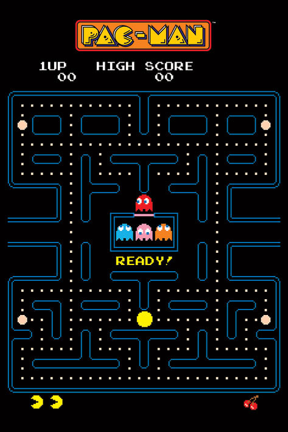

# 2022-2023 - PROJECT 2 - X86 RETROGAMING - TEAM 1

# Functional Specification

📖 Table of content

- [2022-2023 - PROJECT 2 - X86 RETROGAMING - TEAM 1](#2022-2023---project-2---x86-retrogaming---team-1)
- [Functional Specification](#functional-specification)
  - [I. Overview](#i-overview)
    - [1. Project scope](#1-project-scope)
    - [2. Milestones](#2-milestones)
    - [3. The current state of Pac-Man](#3-the-current-state-of-pac-man)
      - [A. What is Pac-Man](#a-what-is-pac-man)
      - [B. Yesterday](#b-yesterday)
      - [C. Today](#c-today)
      - [D. Tomorrow](#d-tomorrow)
      - [E. Game Mechanics](#e-game-mechanics)
  - [II. Requirements](#ii-requirements)
  - [III. Goals and constraints](#iii-goals-and-constraints)
  - [IV Non-functional requirements](#iv-non-functional-requirements)
  - [V. Personas and scenario](#v-personas-and-scenario)
    - [1. Hervé](#1-hervé)
    - [2. Jessica](#2-jessica)
    - [3. Vanessa](#3-vanessa)
  - [VI. Solution Overview](#vi-solution-overview)
      - [A. User Interface (UI)](#a-user-interface-ui)
      - [B. Game Mechanics](#b-game-mechanics)
  - [VII. Risk Mitigation](#vii-risk-mitigation)
  - [VIII. Security](#viii-security)
  - [IX. Evaluation criteria](#ix-evaluation-criteria)
  - [Project role distribution](#project-role-distribution)
  - [Glossary](#glossary)

| | |
| ----- | ----- |
| Author(s) | Grégory PAGNOUX |
| Reviewer(s) | Victor LEROY, Salaheddine NAMIR |
| Created on | 11/06/2023 |
| Last updated | 11/09/2023 |

## I. Overview

### 1. Project scope

[ALGOSUP](https://algosup.com)[^1] requested us to recreate a Pac-Man game[^2] with some twists while keeping the style of the original game, we will obviously have to get a working game before adding any changes. In order to get a better immersion, we will be using an emulator[^3] from 90's computer to run, display and play the game.

### 2. Milestones

| Date | Deliverable |
| :-: | :-: |
| 11/13/2023 | Functional Specification |
| 11/27/2023 | Technical Specification |
| 12/08/2023 | Test plan |
| 12/11/2023 | Working prototype |
| 12/21/2023 | Final Product |
| 12/22/2023 | Presentation |

### 3. The current state of Pac-Man

#### A. What is Pac-Man

Pac-Man is a maze game in which you play as a little yellow diagram who has to eat little dots named pac-gum without getting caught by the four ghosts, Blinky in red, Pinky in orange, Clyde in pink and Inky in blue.

To finish the game, you need to complete 256 levels and today, the best record was held by American Billy Mitchell, who in 1999 became the first player to achieve a perfect score of 3,333,360 points in the game. He completed all 256 levels in six hours, catching all the fruits, eating all four ghosts with every bonuses, and losing no lives on each level.

#### B. Yesterday

Pac-Man is a game released during 1980, that was an immediate success. It is in the Top 5 of the best games from the 80's.
The game was imagined by Tōru Iwatani[^4] for women because at this time, main players were men. For that, he implemented a game without stereotypes and with basic and neutral colors. There are also 4 ghosts including one feminal, smarter than the 3 others.

*Sources :* [Sens Critique](https://www.senscritique.com/top/resultats/les_meilleurs_jeux_video_des_annees_1980/558562) / [Janette](https://janette.lu/les-jeux-video-les-plus-emblematiques-des-annees-80/) / [Holy Gamer Z](https://www.holygamerz.com/fr/meilleurs-jeux-video-des-annees-80-quelques-noms-pour-se-rafraichir-la-memoire)

#### C. Today

It is still one of the most famous games in the world. Everyone knows the little yellow diagram and the colors of the four ghosts.
Today, we have many new games (last one is Pac-Man World Re-Pac released the 08/26/2022), a little animated serie composed of 44 episodes, and lots of by-products.

*Sources :* [Bandai Namco, new game](https://fr.bandainamcoent.eu/pac-man/infos/le-jeu-pac-man-world-re-pac-disponible-le-26-aout-2022) / [Wikipédia](https://en.wikipedia.org/wiki/Pac-Man_(TV_series)) / [Bandai Namco, by-product](https://store.bandainamcoent.eu/fr/games/brands/pac-man/?page=1)

#### D. Tomorrow

Pac-Man is the most bought game on the Atari 2600[^5], 9th on the Game Boy Advanced[^6], 3rd on mobile and is the best arcade selling. There is also Ms. Pac-Man which is the 5th most-selling arcade game.
Many new games keep getting released with tons of by-products, so Pac-Man will continue to exist for several decades.

*sources :* [Wikipédia](https://fr.wikipedia.org/wiki/Liste_des_jeux_vidéo_les_plus_vendus)

#### E. Game Mechanics

**Movements**

Each ghost has his own behaviour in the maze to trick the player into losing:
- Blinky is the only ghost stalking Pac-Man across the map and will always find a way to get to him
- Pinky will try to get in front of Pac-Man to trap him with Inky
- Clyde is the most harmless, because he has random movement, as soon as he gets too close to Pac-Man, he automatically heads for the bottom-left corner of the maze.

You can move the Pac-Man character using key arrows from top to bottom and left to right, but also from left to right side of the maze thanks to a small corridor on each side.

One of the basic rules in a labyrinth is that Pac-Man can't go through walls, just like ghosts.

**Items**

As you progress through the game, new bonuses appear to help you overcome the difficulty, which increases the further you get.
Here's a list of all the items you can find in the order of the original game :
| ITEMS | BONUS | COLOR | SPAWN LOCATION | Spawn Time |
| :-: | :-: | :-: | :-: | :-: |
| Pac-Man |  | yellow | in the middle of the seventh line of the maze from bottom | at the start |
| Blinky |  | red | above and outside the house of ghosts | at the start |
| Pinky | the smartest ghost | pink | on the house of ghosts | at the start |
| Inky |  | blue | on the house of ghosts | 5 seconds after the start |
| Clyde | the most random behave ghost | orange | on the house of ghosts | 20 seconds after start |
| Pac-dot | +10 points, slows Pac-Man for 1/60 frame everytime it's eaten | beige | on all paths except those around the ghost house | at the start |
| Pac-gum | +50 points,   changes the color of ghosts,   Pac-Man can eat ghost during 10 seconds | beige | each end on the seventh line and on the third line from top. | at the start |
| cherry | +100 points | red | Pac-Man starting point | all 25 seconds |
| strawberry | +300 points | red | Pac-Man starting point | all 25 seconds |
| orange | +500 points | orange | Pac-Man starting point | all 25 seconds |
| apple | +700 points | red | Pac-Man starting point | all 25 seconds |
| melon | +1000 points | green | Pac-Man starting point | all 25 seconds |
| spaceship | +2000 points | yellow | Pac-Man starting point | all 25 seconds |
| bell | +3000 points | orange | Pac-Man starting point | all 25 seconds |
| key | +5000 points | blue | Pac-Man starting point | all 25 seconds |

**Lives**

The player has three lives that can get lost when he gets eaten by a ghost. When the player loses all his lives, the game is over and has to start over from the beginning. However, every 10.000 points, Pac-Man get a 1 extra life (1up).

*sources :* [Etale ta Culture](https://www.etaletaculture.fr/geek/les-4-fantomes-de-pac-man-ont-un-secret/) / [Le guide du collectionneur](https://leguideducollectionneur.fr/2017/12/22/bonus-pac-man/)

## II. Requirements

- Windows/MacOS
- DOSBox
- Assembly x86
- Recreate a Pac-Man game from 90's computer
- Improve the original game

## III. Goals and constraints

**Goals :**

- recreate the maze :
  - wall (blue, with colision)
  - road (black)
  - ghosts house
- Implement Pac-Man (yellow)
- implement keybindings to move with Pac-Man
- Implement 4 ghosts :
- implement the ghosts AI
- point system :
  - pac-dot and pac-gum
  - eaten ghosts
  - cherry
- bonus :
  - pac-gum
  - heart (purple, can add 1 life)
- implement life system :
  - lose one life
  - gain one life
  - game over when the player have no lives left
- display score
- play music
- play sounds :
  - eat pac-gum
  - eat ghost
  - ghost kills you
- create winning screen
- create game over screen
- create home menu:
  - play
  - exit
  - settings

**Constraints :**

- Programming language : Assembly x86[^7]
- Emulator : DOSBox[^8]
- 16-bit processor
- Respect Pac-Man style

## IV Non-functional requirements

There aren't a lot of non-functional requirements but those that exist are the following one:
- The game must keep the classic PAC-MAN feeling, even if we're allowed to improve it
- The game should be playable on a x86 emulator
- The game must not be subject to crashes or major bugs during execution.

## V. Personas and scenario

 **Target audience**

Pac-Man is a world-wide known game and built its place in the heart of a lot of players. Our product is therefore intended to men and women, young and old people, new players and nostalgic players. Pac-Man is a PEGI 3[^9] game and an Everyone ESRB[^10].

### 1. Hervé

Hervé is a nostalgic player who knows Pac-Man since its release. He is a 52 year old man. He divorced his wife 3 years ago with whom he had two children, Jessica and Nathan who are 12 and 21 years old. He lives in a little house with a garden in Nançay with Jessica. Nathan lives in the UK for his studies. He has all the nostalgic games like the Game Boy, Atari 7800[^11] or the Apple Pippin[^12]. He works in a little restaurant as a chef.

Jessica showed him a new version of Pac-Man on her computer with new features and he wanted to try to play this game to get a flashback of the good old times he had playing it. He installs the game on his computer and launches the game.
He is on the home page of the game with play, exit and settings buttons. He directly clicks on the play button and the maze is displayed with the Inky, Pinky and Clyde ghosts in their house in the middle of the maze, Blinky outside the door house in the top of the house, Pac-Man in the middle of the seventh line from the bottom of the maze.
Nothing moves but the music starts and when he clicks on the right arrow, Pac-Man starts to move to the right. He eats his first pac-gum with the sound and add fifty points on the score. After, he goes up with the up arrow, right and down. Hervé eats a pac-gum and it gives him 50 points and the power to eat ghosts during 10 seconds. So he decides to eat Blinky because he is in front of him.
He continues to browse the maze but Pinky eats him once and he loses one life. During 3 minutes, Hervé tries to eat all the pac-dots on the maze but loses all his lives. The Game over screen appears on the display for 5 seconds and then returns to the home page. He wants to retry, but he has to go to work. He clicks on the exit button and the game closes.
He'll take his revenge in the evening.

### 2. Jessica

Jessica is the Hervé's daughter, 12 years old and she lives with her father. She has a brother, Nathan, 21 years old but he lives in UK for his studies. She's a middle school student. Her father gave her a passion for retrogaming, and for the past two years she has been discovering new versions of arcade games on her computer.

Today, while browsing a site where all the games can be found, she discovered Pac-Man and decided to install it.
She arrives on the home page with the play, exit and setting buttons. She doesn't know the game, so she clicks on settings and finds the bindings required to play the game. She can also switch music and sounds, or turn them on and off. Once she's made her few adjustments, she clicks on the back button to return to the home page.
She clicks on play and moves Pac-Man to the left using the left arrow. Jessica doesn't like playing with music and sounds, so she turned everything off. All she sees are people passing over the dots to make them disappear and increase her score.
She gets caught by the ghosts, which causes her to lose lives, but after several trial rounds, she discovers a new bonus, a cherry. Thanks to this bonus, she has earn 200 points.
She finally finishes the game and the Win page is displayed for 5 seconds with her score, then she returns to the home page.
She then decides to go and see her father to show him the game she's just discovered and loves.

### 3. Vanessa

Vanessa is a young woman of 25 years old and she lives alone in Angoulême. Vanessa has been passionate about video games of all kinds since childhood. She grew up watching her older brother play video games. Her love of video games has followed her into adulthood. She specializes in game speed-running, which means that her aim is to finish games as quickly as possible but not with the best score (any%). In fact, she's made it her job to make YouTube videos on these games, which she finishes in no time.

Today, Vanessa wants to rediscover an old game for a little YouTube video on her computer and she finds our game. The goal is always the same : eat every dots as fast as possible without getting eaten by the ghosts. She launches the game and the home page appears. She clicks on setting to remove only the music, while keeping the sounds, and launches the game. She starts to move Pac-Man, and goes back and forth up and down and left and right without latency or crash.
She finishes the game in 1 hour.

## VI. Solution Overview

#### A. User Interface (UI)

The product must be a simple game play like the original, with only keys arrows of the keyboard. We must keep simple and neutral colors, the music and sounds must also keep the style of the first game. 

#### B. Game Mechanics

The game will have the same mechanics to move in the maze and to eat points or ghosts.
Some improvements will be made like new bonuses but always in compliance with the game style.

## VII. Risk Mitigation

**Some risks that could lead to the failure of the project :**

- Too ambitious : improving the game to a point where we forget its roots, but also creating unnecessary features. Which could basically lead us to an unfinished game.
- Too simple : sticking to the original game without trying to improve it.
- Copyright[^13] regulations : make features that are not in compliance with the copyright law.

**Yet those risks can be avoided by :**

- Make sure that we are keeping the core gameplay from the original game, not focusing too much on the features in order to provide a complete and working game.
- Brainstorming and discussing about the features we want to add the game, that could improve the player's game experience.
- Regarding the copyright law, as we are working on an educational project, there won't be any problem. We won't sell our game nor get any profit from it.

## VIII. Security

**Copyright**

The game is under copyright protection and we need to respect some rules in compliance to the law :

- The author enjoys a perpetual, inalienable and imprescriptible right to respect for his name, his status and his work (Article L121-1)
- Must in no way interfere with the normal exploitation of the work, nor cause unjustified prejudice to the legitimate interests of the author (Article L122-5)
- The author may not prohibit the reproduction of excerpts of works for the exclusive purpose of illustration in the context of education and vocational training (Article L122-5 12°)
- Right to reproduce the game for non-profit purposes (Article L122-5-1)

*source :* [French legislature](https://www.legifrance.gouv.fr/codes/section_lc/LEGITEXT000006069414/LEGISCTA000006146349/#:~:text=L%27auteur%20jouit%2C%20sa%20vie,soixante%2Ddix%20années%20qui%20suivent.)

**Data saving**

There are three different archives depending on the type of data :

- Active database archiving where data that are no longer useful to the enterprise (for example, data on job seekers to which they have not followed up) are deleted once the reason for the study has been completed (after a maximum of two years).
- Intermediate archiving where data are saved even after the purpose of data collection has been achieved as they are still of interest to the enterprise. The duration is set by the person responsible and must be relevant to its usefulness.
- Final archiving where data that remains of great interest in the future without an end date are saved, after an upstream check.

*source :* [CNIL](https://www.cnil.fr/sites/default/files/atoms/files/guide_durees_de_conservation.pdf)[^14]

**Age**

The age to play certain games is regulated by the PEGI limitation in Europeen Union or the ESRB in USA.
Criterias are the violence, drugs, sex or money game.

*source :* [Culture Game](https://www.culture-games.com/capsule-technique/pegi-le-systeme-devaluation-europeen-des-jeux-video) / [ESRB](https://www.esrb.org/)

## IX. Evaluation criteria

We will consider this project a success if we have a working game coontaining the original game and some new features. Every knowledge acquired during the project will be a bonus, adding to the global success rating of the project.

## Project role distribution

| PERSON | ROLE | MAIL |
| :-: | :-: | :-: |
| Alexis LASSELIN | Project Manager | [alexis.lasselin@algosup.com](mailto:alexis.lasselin@algosup.com) |
| Grégory PAGNOUX | Program Manager | [gregory.pagnoux@algosup.com](mailto:gregory.pagnoux@algosup.com) |
| Salaheddine NAMIR | Tech Leader | [salaheddine.namir@algosup.com](mailto:salaheddine.namir@algosup.com) |
| Jason GROSSO | Senior Software Engineer | [jason.grosso@algosup.com](mailto:jason.grosso@algosup.com) |
| Abderrazaq MAKRAN | Junior Software Engineer | [abderrazaq.makran@algosup.com](mailto:abderrazaq.makran@algosup.com) |
| Victor LEROY | Quality Assurance | [victor.leroy@algosup.com](mailto:victor.leroy@algosup.com) |

## Glossary

[^1]: ALGOSUP
ALGOSUP is an IT school in Vierzon created in 2019 by Franck JEANNIN, Natacha BOEZ and Eric LARCHEVÊQUE. The goal of the school is to form student in the companies conditions, with team work, each roles that we can find in a company. A last thing, all the program is only in english.
*source :* [ALGOSUP site](https://algosup.com)

[^2]: Pac-Man
It's a game created by Tōru Iwatani and edited by Namco in 1980 with the first arcade game and designed for women. Today, we have 32 game in arcade, flipper and console.
Pac-Man is a little circular diagram who navigate in the maze to eat all small pac-gum, but four ghosts navigate randomly in the maze and Pac-Man doesn't touch one of it. So, we have some bonus like big pac-gum, you can eat ghosts, or cherries to earn more points.
*source :* [La voie du Nord](https://www.lavoixdunord.fr/755801/article/2020-05-22/pac-man-fete-ses-40-ans-cinq-choses-que-vous-ignorez-peut-etre-sur-lui#) / [Le guide du collectionneur](https://leguideducollectionneur.fr/2017/12/22/bonus-pac-man/)

[^3]: Emulator
An emulator is a software that allows a computer system to reproduce the behavior of another computer system. It makes it possible to run programs developed for a specific architecture on a computer with a different architecture.
*source :* [Wikipédia](https://en.wikipedia.org/wiki/Emulator)

[^4]: Tōru Iwatani
Tōru Iwatani, born January 25, 1955, is a Japanese video game designer, known for the arcade game Pac-Man
*source :* [Wikipedia](https://en.wikipedia.org/wiki/Toru_Iwatani)

[^5]: Atari 2600
The Atari 2600 is a home video game console released in September 1977 by Atari, Inc.
*source :* [Wikipedia](https://en.wikipedia.org/wiki/Atari_2600)

[^6]: Game Boy Advanced
The Game Boy Advanced (GBA) is a 32-bit handheld developed by Nintendo.
*source :* [Wikipedia](https://en.wikipedia.org/wiki/Game_Boy_Advance)

[^7]: Assembly
Assembly language is a low-level language that relies on a strong relationship between the instructions input using the coding language and how a machine interprets the code instructions.
*source :* [Investopedia](https://www.investopedia.com/terms/a/assembly-language.asp#:~:text=Assembly%20language%20is%20low-level,recognizable%20instructions%20for%20the%20machine.)

[^8]: DOSBox
DOSBox is a DOS-emulator that uses the SDL-library which makes DOSBox very easy to port to different platforms. DOSBox has already been ported to many different platforms, such as Windows, BeOS, Linux, MacOS X...
*source :* [dosbox offical website](https://www.dosbox.com/information.php?page=0)

[^9]: PEGI (Pan-European Game Information)
The ISFE (Interactive Software Federation of Europe) founded PEGI in 2003, a system for classifying video games by age and content. The primary objective of PEGI is not restrictive, but informative. By knowing the pictograms, parents can see at a glance the nature of the content of a game and thus avoid putting unsuitable games in their children's hands.
*source :* [Culture Game](https://www.culture-games.com/capsule-technique/pegi-le-systeme-devaluation-europeen-des-jeux-video)

[^10]: ESRB (Entertainment Software Rating Board)
Since 1994, ratings provides informations about what’s in a game or app so parents and consumers can make informed choices about which games are right for their family. Ratings have 3 parts: Rating Categories, Content Descriptors, and Interactive Elements.
*source :* [ESRB](https://www.esrb.org/)

[^11]: Atari 7800
The Atari 7800 ProSystem is a consul for video games produced by Atari, submitted May 21 1984 as a replacement for the 'Atari 5200 and marketed from 1986 until 1992. The console is backward-compatible with cartridges made for the 'Atari 2600.
*source :* [BooWiki](https://boowiki.info/art/console-atari/atari-7800.html)

[^12]: Apple Pippin
The Pipp!n (or Pippin, also called Bandai Pippin or Bandai Pipp!n) is a video game console designed by Apple and marketed in 1995 by Bandai.
*source :* [Emu France](http://www.emu-france.com/emulateurs/5-consoles-de-salon/364-apple-pippin/)

[^13]: Copyright
Exclusive right held by an author or his representative to exploit a work (symbol : ©).
*source :* [Le Robert](https://dictionnaire.lerobert.com/definition/copyright)

[^14]: CNIL (Comission National Informatique & Libertés)
CNIL is an administrative authority that has existed since January 6, 1978, and ensures the proper use and security of computer data.
*source :* [CNIL](https://www.cnil.fr/en/cnil/cnils-missions) / [Wikipédia](https://en.wikipedia.org/wiki/Commission_nationale_de_l%27informatique_et_des_libertés)
