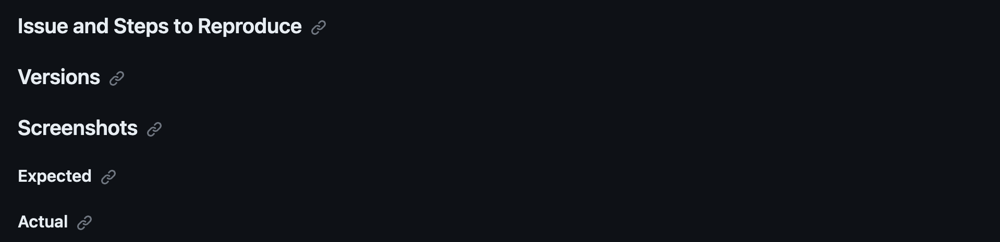

# Test Plan

---

<details>

<summary>📖 Table of content</summary>

- [Test Plan](#test-plan)
  - [Testing Strategy](#testing-strategy)
  - [Testing Schedule](#testing-schedule)
  - [Test Cases](#test-cases)
  - [Testing Tools](#testing-tools)
    - [Hardware](#hardware)
    - [Software](#software)
    - [Defects Tracking](#defects-tracking)

</details>

---

The following document describes the test plan for the Pac-man project.

The main goal of this game testing plan is to ensure that the game is working as expected and that the game is playable.

## Glossary

| Term | Definition |
| --- | --- |
| Smoke Test | A smoke test is a type of software testing that comprises of a non-exhaustive set of tests that aim at ensuring that the most important functions work. |
| Functional Test | Functional testing is a quality assurance (QA) process and a type of black-box testing that bases its test cases on the specifications of the software component under test. |
| Regression Test | Regression testing is a type of software testing that seeks to uncover new software bugs, or regressions, in existing functional and non-functional areas of a system after changes such as enhancements, patches or configuration changes. |
| Test Case | A test case is a set of conditions or variables under which a tester will determine whether an application, software system or one of its features is working as it was originally established for it to do. |

## Testing Strategy

The testing strategy for this game is to test the game manually. The tester will test the gamed during and after the development process to ensure that the game is playable and that the game is working as expected. 

At first we will do a smoke test to ensure that the game is working and that the game is playable. Then we will do a functional test to ensure that the game is working as expected. Finally we will do a regression test to ensure that the game is still working after each update.

The QA will also be in charge to verify the documents to make sure that they are up to date and that they are correct.

## Scope of testing

Here are the different main areas that we will test during the testing of the game:

| Area | Action | Description |
| --- | --- | --- |
| Game | Start | The game should start when the user clicks on the start button |
| Game | Pause | The game should pause when the user clicks on the pause button |
| Game | Resume | The game should resume when the user clicks on the resume button |
| Game | Restart | The game should restart when the user clicks on the restart button |
| Game | Exit | The game should exit when the user clicks on the exit button |
| Game | Movement | The player should be able to move up, down, left and right |
| Game | Game Over | The game should end when the player loses all lives |
| Game | Victory | The game should end when the player wins all levels, even tho it's not very likely to happen |
| Game | Level | The game should change level when the player eats all the dots |
| Game | Score | The game should increase the score when the player eats a dot, a fruit or a ghost |
| Game | Lives | The game should decrease the lives when the player is eaten by a ghost |
| Game | Ghosts | The ghosts should move randomly around the map |
| Game | Ghosts | The ghosts should move towards the player when they are in the same row or column |
| Game | Ghosts | The ghosts should move away from the player when they are in the same row or column and the player has the power up |
| Game | Collision | The player should be able to collide with the walls |
| Game | Collision | The player should be able to collide with the ghosts |

Test areas might change according to the development of the game.

## Testing Schedule

This test plan is written before the development of the game, so the testing schedule is not yet defined. We started the development of the game on the 6th of November and the deadline is on the 21st of December. We will update this section when we have a better idea of the testing schedule, based on how the development of the game is going.

## Smoke Testing 

The smoke testing will be done during the development of the game. 

It will be composed of the following tests:
- Start the game
- Pause the game
- Basic movement of the player
- Collision with the walls
- Collision with the ghosts
- Basic interactions

The goal is to test if the main features of the game are working and if the game is playable. If we find a defect during the smoke testing, we will create an issue on GitHub and we will assign it to the developer who will fix the defect.

## Test Cases

The following table will be an example of a test case that we will use to test the game. We will create a test case for each test that we will do during the testing of the game. We will also add a label to the test case to indicate the priority of the test case.

| Test Case ID | ID |
| --- | --- |
| Test Case Name | Name of the test case |
| Test Case Description | Description of the test case |
| Test Case Pre-conditions | Requirements for the test |
| Test Case Steps | Steps to go from the current state to the expected result |
| Test Case Expected Result | Result expected after following the steps |
| Test Case Actual Result | Actual result of the test (could differ from what's expected) |
| Test Case Status | Status of the test (To Test ⏳, Testing 🔎, Tested ✅) |
| Test Case Priority | Defines if a test is important or not. Using symbols : Low 🟢 / Medium 🟠 / High 🔴|
| Test Case Assigned To | Name of the tester |

All these test cases will be stored in a Google Sheets document : [TestCases_BugReport_x86Assembly_Team1](https://docs.google.com/spreadsheets/d/1J5YRSXsImOCFuaOzA-Vpo5ZxYwILIXlkPwnCMQx_Muw/edit?usp=sharing), but can also be found on the ```TestCases.md```.

## Testing Tools

### Hardware

- [MacBook Air 2020](https://www.apple.com/fr/macbook-air-m1/)
  - 13.3 inch (2560 x 1600)
  - macOS Ventura 13.0
  - Apple M1 Chip

- [Lenovo Thinkbook 14](https://pcsupport.lenovo.com/us/en/products/laptops-and-netbooks/thinkbook-series/thinkbook-14-iil/20sl)
  - Windows 11 Pro
  - 14 inch (1920 x 1080)
  - Processor: Intel(R) Core(TM) i7-1065G7 CPU @ 1.30GHz
  - RAM: 16.0 GB
  - System type: 64-bit operating system, x64-based processor
  
- [ThinkPad E14 Gen 5](https://www.lenovo.com/fr/fr/p/laptops/thinkpad/thinkpade/thinkpad-e14-gen-5-(14-inch-intel)/len101t0064)
  - Windows 11 Pro
  - 14 inch (1920 x 1080)
  - Processor: 13th Gen Intel(R) Core(TM) i7-1355U, 1700 Mhz
  - RAM: 16.0 GB
  - System type: 64-bit operating system, x64-based processor

### Software

- [Visual Studio Code](https://code.visualstudio.com/) for the development of the game
- [GitHub](https://github.com) for the version control and to track the defects
- [NASM](https://www.nasm.us/) for the assembly language
- [DOSBox 0.74-3 for macOS](https://sourceforge.net/projects/dosbox/files/dosbox/0.74-3/DOSBox-0.74-3-3.dmg/download) for the testing of the game on macOS, emulating a DOS environment, with a 16-bit processor, x86 architecture and 65536 Bytes of memory.
- [DOSBox 0.74-3 for Windows](https://sourceforge.net/projects/dosbox/files/dosbox/0.74-3/DOSBox0.74-3-win32-installer.exe/download) for the testing of the game on Windows.

### Defects Tracking

We will use GitHub Issues to track the defects of the game. We will create a new issue for each defect that we find during the testing of the game. Every issue will be labeled with the `bug` label and will be assigned to the developer who will fix the defect. But also with a description of the defect, the steps to reproduce the defect and the expected result and finally the actual result. We will also add a screenshot or a video of the defect if it's possible. Finally we will add a label to the issue to indicate its priority level.

This is an example of an issue that we will create for a defect:


