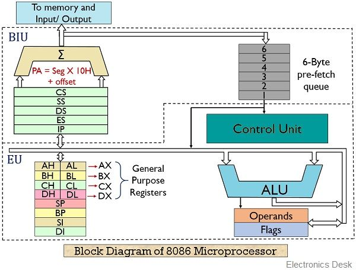
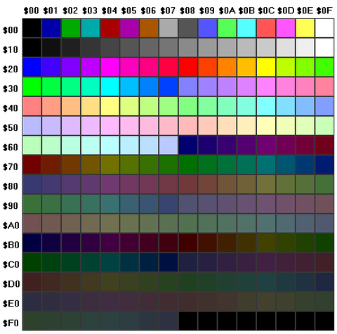
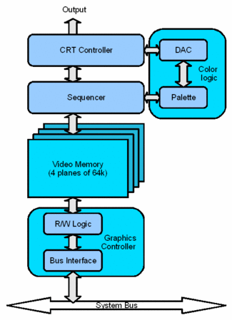
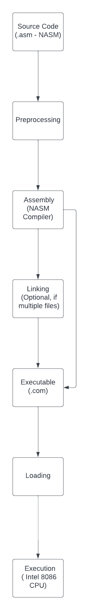
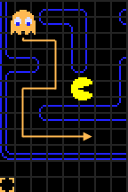

# 2023-2024 - PROJECT 2 - X86 RETROGAMING - TEAM 1
                    

# Technical Specification 

| | |
| ----- | ----- |
| Author(s) |[Salaheddine NAMIR](https://github.com/T3rryc)|
| Reviewer(s) |...|
| Created on |11/20/2023|
| Last updated |11/27/2023|

# Table of Contents
1. [Introduction](#introduction)
2. [Glossary](#glossary)
3. [Functional and Technical Requirements](#functional-and-technical-requirements)
4. [Code Organization](#code-organization)
5. [Hardware architecture](#hardware-architecture)
6. [Software architecture](#software-architecture)
7. [Software requirements](#software-requirements)
8. [Out of Scope](#out-of-scope)
9. [Future Goals](#future-goals)
10. [Assumptions](#assumptions)
11. [Solutions](#solutions)
12. [Further Considerations](#further-considerations)


## Introduction

### Overview
The Pacman game is a classic arcade game where the player controls a character to navigate a maze, eat pellets, and avoid ghosts. This technical specification outlines the development of Pacman in x86 assembly language for DOSBox.


## Glossary

| Term               | Description                                                                                                                                                                       |
|--------------------|-----------------------------------------------------------------------------------------------------------------------------------------------------------------------------------|
| **[x86 Assembly](https://en.wikipedia.org/wiki/X86_assembly_language)** | A low-level programming language specific to the x86 architecture, It provides a human-readable representation of machine code instructions that can be executed by x86-compatible CPUs, such as those manufactured by Intel and AMD. Assembly language involves direct manipulation of registers, memory, and CPU instructions, offering fine-grained control over hardware.                                                                                                                                                  |
| **[DOSBox](https://www.dosbox.com/)**                           | An x86 emulator with DOS.                                                                                                                                                           |
| **[NASM](https://www.nasm.us/) (Netwide Assembler)**            | NASM is an assembly language compiler for the x86 architecture. It translates assembly language source code into machine code, which can be executed by the computer's CPU. NASM is widely used for writing low-level system software and is known for its portability across various operating systems. It supports Intel-style syntax and is an essential tool in the development of x86 assembly programs. |
|**[Registers](https://en.wikipedia.org/wiki/Processor_register)**|Registers are small, fast storage locations within the CPU that hold data temporarily during program execution. These are used to store operands for arithmetic and logic operations, addresses for memory access, and intermediate results. Registers play a critical role in the CPU's ability to perform operations efficiently.|
|**[CPU](https://en.wikipedia.org/wiki/Central_processing_unit)**|The Central Processing Unit, often referred to as the CPU, is the primary component of a computer responsible for executing instructions of a computer program. It performs arithmetic and logic operations, manages data movement between different storage locations, and controls the overall execution of instructions. The CPU is often considered the "brain" of a computer.|
|**[Interrupts](https://en.wikipedia.org/wiki/Interrupt)**|An interrupt is a signal that interrupts the normal flow of program execution. Interrupts are used for handling events such as user input, hardware errors, and other asynchronous events. The CPU responds to interrupts by suspending the current program and executing an interrupt handler. The interrupt handler is a special routine that handles the interrupt and resumes the execution of the interrupted program.|
|**[I/O](https://en.wikipedia.org/wiki/Input/output)**|Input/Output (I/O) operations involve transferring data between the CPU and external devices such as keyboards, displays, and storage devices. I/O operations are performed using special instructions that transfer data between the CPU and the I/O device. The I/O device is connected to the CPU via an I/O port, which is a special addressable location in memory.|
|**[Memory Management](https://en.wikipedia.org/wiki/Memory_management)**|Memory management is the process of managing the memory address space. The CPU can allocate and deallocate memory, ensuring that the memory address space is used efficiently. Memory management is essential for the proper functioning of the Pacman game, as it allows the CPU to allocate memory for the game's code and data.|


## Functional and Technical Requirements

The development and execution of the Pacman game in x86 assembly language for DOS entail specific technical requirements to ensure compatibility, performance, and adherence to project goals.

### Platform Compatibility
The primary platform for running the Pacman game is DOSBox. The compiled program should function seamlessly within the DOSBox environment. Compatibility testing will be conducted to ensure optimal performance and user experience.

### Compilation Process
The source code for the Pacman game will be written in x86 assembly language. The NASM (Netwide Assembler) will be employed for compiling the source code into executable machine code. The compilation process should generate a .com file that is compatible with the 16-bit architecture.

### Hardware Specification
The Pacman game is designed to run on a 16-bit CPU architecture. Compatibility with hardware configurations featuring a 16-bit CPU is a crucial requirement for the proper execution of the game. The game's performance and functionality will be optimized for this specific hardware specification.

### Execution Environment
The compiled Pacman program, in the form of a **.com** file, should be capable of running within the DOSBox environment without encountering compatibility issues. The execution environment will be thoroughly tested to ensure the game behaves as intended and leverages the capabilities of DOSBox effectively.

### User Interface
The user interface elements, including graphics rendering and text display, will be tailored to the limitations and capabilities of the DOS environment. The Pacman game should provide a visually engaging and nostalgic experience while maintaining compatibility with the 16-bit CPU architecture.

### Input Handling
User input for controlling Pacman's movement will be processed efficiently within the DOS environment. The game should respond accurately to keyboard inputs, facilitating an intuitive and enjoyable gaming experience.

### Sound Support
Consideration will be given to incorporating sound effects within the limitations of the DOS environment. The game may include basic audio cues for actions such as pellet consumption, ghost encounters, and level completion.

### Performance Optimization
The Pacman game will undergo rigorous testing to identify and address any performance bottlenecks. Optimization strategies will be implemented to ensure smooth gameplay on hardware featuring a 16-bit CPU, providing an enjoyable experience for users running the game on DOSBox.

### Error Handling
Robust error-handling mechanisms will be integrated to gracefully manage unexpected scenarios, ensuring the game's stability and preventing crashes. Error messages, when necessary, will be informative and user-friendly.

### Documentation
Comprehensive documentation will be provided for the source code, compilation process, and any additional configurations required for running the Pacman game on DOSBox. This documentation will serve as a valuable resource for developers, reviewers, and users.

### Development Environment
#### Operating System
The development environment will primarily target Windows and MacOS.
The game will be tested and optimized for compatibility with the DOSBox emulator.
#### Programming Language
Assembly language x86 will be used for the implementation of the Pac-Man game.
#### Emulator
**[DOSBox](https://www.dosbox.com/)** will serve as the emulator for testing and running the developed game.
#### Tools and Libraries
##### IDE
**[Visual Studio Code](https://code.visualstudio.com/)**  will be the primary code editor for coding.
##### Build Tools
**[NASM](https://www.nasm.us/)** will be used for assembling the x86 assembly code.
##### Version Control
**[Git](https://git-scm.com/)** will be utilized for version control.
##### Graphics
Simple graphics will be created using **bitmaps** files for the maze, UI and sprites.
##### Sounds
Sound effects and background music will be implemented using **.wav** files.
## Code Organization
### Directory Structure
```
pacman/
|-- bin/
|-- build/
|   |-- buildPacman.cmd
|   |-- buildPacman.sh
|   |-- runDOSbox.cmd
|   |-- runDOSbox.sh
|   |-- nasmSetup.cmd
|   |-- nasmSetup.sh
|-- nasm/
|   |-- MacOS/
|   |-- Windows/   
|-- srcs/
|   |-- main.asm
|   |-- pacman.asm
|   |-- ghosts.asm
|   |-- display.asm
|   |-- input.asm
|   |-- sound.asm
|-- assets/
|   |-- maze/
|   |    |-- maze.bmp
|   |-- sprites/
|   |    |-- pacman/
|   |    |       |-- (pacman sprites in .bmp format)
|   |    |-- ghosts/
|   |    |       |-- (ghost sprites in .bmp format) 
|   |    |-- collectibles/
|   |            |-- (collectible sprites in .bmp format)   
|   |-- ui/    
|   |   |-- (user interface elements in .bmp format)    
|   |-- sounds/
|   |   |-- (sound effects in .wav format)   
|   |-- music/
|       |-- (background music in .wav format)
|-- docs/
|   |-- specification/
|   |   |-- technical-specification.md
|   |   |-- functional-specification.md
|   |-- QA/
|   |   |-- test-plan.md
|   |   |-- test-cases.md
|   |-- project-management/
|       |-- projectCharter.md
|-- .gitignore
|-- README.md
|-- LICENSE
```             


### Implementation Details
#### Pac-Man Movement
Pac-Man will move based on user input.
Collision detection with walls and collectibles will be implemented.
#### Ghost AI
Ghosts will have distinct behaviors, following Pac-Man with variations.
Implement a basic AI algorithm for ghost movement.
#### Scoring System
Points will be awarded for eating pac-dot, pac-gum, and ghosts.
Implement a scoring system and track player score.
#### User Interface
Display score, lives, and other relevant information.
Create game screens for start, win, and game-over scenarios.
#### Sound Integration
Integrate sound effects for in-game events.
Include background music during gameplay.

## Hardware architecture
The Pacman game is intricately designed to leverage the capabilities of the **[Intel 8086 CPU](https://en.wikipedia.org/wiki/Intel_8086)**, featuring a 16-bit architecture that provides a foundation for efficient and responsive gameplay.
#### CPU 
##### Registers
|8bits|definition|16bits|definition|
|-----|----------|------|---------|
|**AL**|Accumulator Low|**AX**|Accumulator|
|**BL**|Base Low|**BX**|Base|
|**CL**|Counter Low|**CX**|Counter|
|**DL**|Data Low|**DX**|Data|
|**AH**|Accumulator High|**SP**|Stack Pointer|
|**BH**|Base High|**BP**|Base Pointer|
|**CH**|Counter High|**SI**|Source Index|
|**DH**|Data High|**DI**|Destination Index|
|**IP**|Instruction Pointer|**CS**|Code Segment|
|**SS**|Stack Segment|**DS**|Data Segment|
|**ES**|Extra Segment|**FS**|Extra Segment|
|**GS**|Extra Segement|**FLAGS**|Flags|

##### Additional Segments
In addition to the standard segments, the Intel 8086 architecture introduces Extra Segments (FS and GS), providing extra storage space and flexibility for advanced programming.

##### Flags Register (FLAGS)
The FLAGS register is pivotal for program control and condition monitoring. It comprises individual flags, including Zero Flag (ZF), Sign Flag (SF), Carry Flag (CF), Overflow Flag (OF), and others. These flags reflect the outcome of arithmetic and logical operations, guiding program flow.

##### Memory Segmentation
The Intel 8086 architecture utilizes a segmented memory model, where the memory address space is divided into segments. Each segment is 64KB in size and is identified by a 16-bit segment register. The segment registers are CS (Code Segment), DS (Data Segment), SS (Stack Segment), and ES (Extra Segment). The segment registers are used to calculate the physical memory address of a data item, combining with the offset address to form a 20-bit physical address.

##### Memory Addressing
The Intel 8086 architecture supports two types of memory addressing: direct addressing and indirect addressing. Direct addressing involves specifying the memory address of the data item directly in the instruction. Indirect addressing involves specifying the address of a memory location that contains the address of the data item. Indirect addressing is useful for accessing data items stored in arrays or other data structures.

##### Instruction Set
The Intel 8086 architecture supports a wide range of instructions, including arithmetic, logical, and control instructions. The instructions are encoded in binary format and are executed by the CPU. The instruction set is designed to provide a rich set of operations for manipulating data and controlling program flow.

##### Interrupts
The Intel 8086 architecture supports interrupts, which are signals that interrupt the normal flow of program execution. Interrupts are used for handling events such as user input, hardware errors, and other asynchronous events. The CPU responds to interrupts by suspending the current program and executing an interrupt handler. The interrupt handler is a special routine that handles the interrupt and resumes the execution of the interrupted program.

##### Input/Output
The Intel 8086 architecture supports input/output (I/O) operations, allowing the CPU to interact with external devices such as keyboards, displays, and storage devices. I/O operations are performed using special instructions that transfer data between the CPU and the I/O device. The I/O device is connected to the CPU via an I/O port, which is a special addressable location in memory.

##### Memory Management
The Intel 8086 architecture supports memory management, allowing the CPU to manage the memory address space. The CPU can allocate and deallocate memory, ensuring that the memory address space is used efficiently. Memory management is essential for the proper functioning of the Pacman game, as it allows the CPU to allocate memory for the game's code and data.

##### Performance Considerations

|||
|-----|-----|
|**Max. CPU clock rate**|5 MHz to 10 MHz|
|**Address width**|20 bits|
|**Data width**|16 bits|
|**Max. memory size**|1 MB|
|**Max. memory bandwidth**|5 MB/s to 10 MB/s|
|**Max. memory transfer rate**|5 MB/s to 10 MB/s|
|**Max. memory latency**|100 ns to 200 ns|
|**Max. I/O bandwidth**|5 MB/s to 10 MB/s|
|**Max. I/O transfer rate**|5 MB/s to 10 MB/s|
|**Max. I/O latency**|100 ns to 200 ns|


##### CPU architecture diagram


#### Video 
##### Graphics Rendering
The Pacman game will utilize the **[VGA](https://en.wikipedia.org/wiki/Video_Graphics_Array)** (Video Graphics Array) standard for graphics rendering. The VGA standard supports a resolution of 640x480 pixels with 16 colors. The game will be designed to render graphics within these constraints, providing a visually engaging experience while maintaining compatibility with the 16-bit CPU architecture.

##### Colors Palette


##### Graphics Rendering Diagram



## Software architecture


#### Compilation process

The compilation process is a crucial step in transforming the high-level source code of the Pacman game into executable machine code that can run on the Intel 8086 CPU. The process involves several stages, each contributing to the creation of an efficient and functional executable.

#### Source Code
The source code is written in NASM assembly language, a low-level programming language that is compatible with the Intel 8086 CPU architecture. The source code is organized into modules, each handling a specific aspect of the game. The modules are compiled separately and linked together to create the final executable.

#### Preprocessing
The preprocessor performs text substitution and macro expansion, preparing the source code for compilation. It removes comments, expands macros, and includes header files, ensuring that the source code is ready for compilation.

#### Compilation
The compiler takes the preprocessed source code and translates it into assembly language or intermediate code. For Pacman, an assembly language compatible with the Intel 8086 CPU architecture is often chosen to maximize control over low-level details.

#### Assembly
The assembly code generated in the compilation stage is then processed by an assembler. The assembler converts the human-readable assembly code into machine code, consisting of binary instructions that the Intel 8086 CPU can understand.

#### Linking
The linker combines the machine code generated for different modules or files, resolving references between them. It creates a single executable file that contains all the necessary code and data for the Pacman game.

#### Loading
The loader loads the executable file into memory, preparing it for execution on the Intel 8086 CPU. It manages memory allocation and ensures that the game's code and data are in the correct locations for efficient runtime execution.

#### Execution
Finally, the Pacman game is ready to run on the Intel 8086 CPU. The CPU fetches instructions from memory, executes them, and interacts with other hardware components to provide an engaging gaming experience.

The compilation process for Pacman is carefully orchestrated to leverage the capabilities of the Intel 8086 architecture, translating high-level concepts into machine code that efficiently utilizes the CPU's registers and instructions. This well-organized process is fundamental to the successful execution of the game on the target hardware.

#### Compilation Process Diagram


### Source Code Modules
#### main.asm
Entry point of the game.
Initializes game components and starts the game loop.
#### pacman.asm
Manages Pac-Man's movement, collision detection, and scoring.
#### ghosts.asm
Implements the behavior and movement of ghosts.
Ghost AI and collision detection with Pac-Man.
#### display.asm
Handles rendering of the game screen.
Displays maze, Pac-Man, ghosts, and game UI.
#### input.asm
Manages user input using arrow keys.
Handles keyboard events for controlling Pac-Man.
#### sound.asm
Integrates sound effects and music into the game.
Plays sounds for eating pac-dot, pac-gum, and other in-game events.
### Game Architecture
#### Game Loop
The game will follow a typical game loop structure.
Input processing, game logic, rendering, and sound playback will be sequential within the loop.
#### Maze Generation
The maze will be represented using a 2D array.
Maze data will be loaded from the **maze.bmp** file.
#### Character Animation
Pac-Man and ghosts will have simple **bitmaps** character animations for movement.


### Ghost AI
Ghost AI will be implemented two kind of pattern, Chase mode and Scatter Mode.
#### Chase Mode
During this phase, ghosts have a path finder for catching pacman depend of the pacman x and y position and which directition he goes up, down, right or left as an input of the player does.
Each ghost will have a different path finder for chasing pacman.
#### Scatter Mode
During this phase, ghosts have a path finder for going to a specific corner of the maze.
#### Frightened mode
When pacman eat a power pellet, the ghosts will be in frightened mode, during this phase, the ghosts will be blue and will have a random path finder for running away from pacman.

#### Mode
Exept the Frightened one, the mode will be implemented with a timer, when the timer is over, the mode will change from chase to scatter and vice versa.
**1st level timer** will be set as follow:
|Mode|Timer|Wave |
|----|-----|-----|
|Scatter|7 seconds|1|
|Chase|20 seconds|1|
|Scatter|7 seconds|2|
|Chase|20 seconds| 2|
|Scatter|5 seconds|3|
|Chase|20 seconds|3|
|Scatter|5 seconds|4|
|Chase|permanently|4|

The timer will be implemented with the **[RTC](https://en.wikipedia.org/wiki/Real-time_clock)** (Real Time Clock) of the computer. The RTC is a battery-powered clock that keeps track of the current time and date. It is often used for timekeeping in computers and other electronic devices. The RTC will be used to implement the timer for the ghost AI.
At each second, the RTC will send an interrupt to the CPU, which will be handled by the interrupt handler. The interrupt handler will update the timer and check if the timer has expired. If the timer has expired, the interrupt handler will change the mode of the ghost AI.
The timer is reset at each level, pacman death and game over.
The timer is froezen when the game is paused, when pacman eat pullet or ghost are on frightened mode.
Each level will have a different timer, the timer will be shorter at each level, however the number of waves stay the same.
#### Ghost Behavior
Each ghost will have a different path finder for chasing pacman.
The path finder will be implemented with the **[A* algorithm](https://en.wikipedia.org/wiki/A*_search_algorithm)** (A Star algorithm), a graph traversal and path search algorithm that is often used in artificial intelligence. The A* algorithm will be used to implement the path finder for the ghost AI.

#### Blinky
Blinky is the red ghost, he will have a path finder for chasing pacman behind him. According the number of pullet eaten, this speed is slightly increase.
In scatter mode, he will go to the top right corner of the maze.<br>

#### Pinky
Pinky is the pink ghost, he will have a path finder for ambushing pacman in front of him.
In scatter mode, he will go to the top left corner of the maze.<br>

#### Inky
Inky is the blue ghost, contrary to the other ghosts, he will have a path finder according to Pacman and Blinky position. He will try to ambush pacman in front of him and go to the way where Blinky goes.
In scatter mode, he will go to the top right corner of the maze.<br>

#### Clyde
Clyde is the orange ghost, he will have a path finder for chasing pacman behind him. However, when he is close to pacman, he will go to the bottom left corner of the maze (scatter mode).<br>
<br>



### Pacman movement
When the player press an arrow key, the pacman will move in the direction of the arrow key, however pacman stay on the same way until the player press other key or a wall block this path.
Pacman is able to move in the 4 directions, up, down, right and left.
#### Collectible

##### Pellet
Pellet are the most common collectible in the game, it disposes on all path on the maze and according to the number eaten and the level, the speed of the ghosts slightly changes. Eat all pellets on the maze to complete the level and earn points.

##### Power Pellet
When Pacman eats a power pellet, the ghosts will be in frightened mode, during this phase, the ghosts will be blue and will have a random path finder for running away from pacman. When Pacman eats a ghost, the ghosts will be sent to the ghost house and pacman will earn points. The timer is frozen when a ghost is eaten.

#### Fruit
Fruit are bonus collectible, they appear on the maze at a specific time, when pacman eat a fruit, he will earn points. The fruit will disappear after a certain time.


#### Lives
Pacman will have 3 lives at the beginning of the game, when he is eaten by a ghost, he will lose a life and respawn at the center of the maze. When pacman lose all his lives, the game is over.

### User Interface

#### Score Display
The Score Display is a crucial component of the user interface, providing real-time feedback on the player's performance. It is prominently positioned on the screen, ensuring visibility throughout gameplay. The score is dynamically updated as the player collects points by consuming pellets, eating ghosts, and achieving other in-game milestones. A clear and legible font is employed, and animations may be implemented to enhance the visual appeal when the score increments.

#### Lives Display
The Lives Display communicates the number of lives remaining to the player. Typically located near the Score Display, it provides a quick reference for the player to gauge their progress and resilience. Each decrement in lives is accompanied by a brief animation or sound effect to draw attention to the change. When a life is lost, the game briefly pauses to allow the player to comprehend the situation before the next life begins.
#### Game Screens
The Game Screens encompass various states of the game, offering a seamless transition between different phases such as start screens, level transitions, and game-over screens. Each screen is meticulously designed with relevant graphics, ensuring a visually engaging experience. Transitions between screens are accompanied by smooth animations or effects, maintaining player immersion.

Start Screen: Welcomes the player and provides options to start a new game, access settings, or view high scores. This screen sets the tone for the gaming experience.

Pause Screen: Accessible during gameplay, the Pause Screen allows players to temporarily halt the game, adjust settings, or quit. It includes options to resume play or return to the main menu.

Level Transition Screen: Displays pertinent information such as the current level, score, and any additional challenges or objectives. It smoothly transitions between levels, maintaining the game's flow.

Game-Over Screen: Appears when the player exhausts all lives. It presents the final score, allows for a new game initiation, and may showcase high scores for added motivation.
#### Sound Integration


#### Sound Effects
Sound Effects play a pivotal role in enhancing the gaming experience by providing auditory feedback for various in-game events. These effects include:

Pac-Man Movement: Audible cues accompany Pac-Man's movement, indicating direction changes and interactions with the environment.

Ghost Movement: Each ghost has a distinctive sound, contributing to the immersive experience. Ghost sounds intensify during moments of pursuit or when transitioning to the frightened state.

Collectibles: Consuming pellets, power pellets, and fruits trigger unique sound effects, providing satisfying feedback for successful actions.

Collision Events: When Pac-Man collides with a ghost or an obstacle, a distinct sound is played to signify the event.
#### Background Music
Background Music sets the overall tone of the game, creating an immersive atmosphere. The soundtrack dynamically adapts to different game states, intensifying during moments of tension and becoming more subdued during less critical phases. Transitions between levels or during significant events are accompanied by seamless shifts in the musical score.


## Software requirements

### NASM version
ver 2.16.01 (2021-03-22), is the lastest stable version of NASM.
This version will be used due to long term support.

### NASM installation
#### Windows
Latest stable version of [NASM](https://www.nasm.us/pub/nasm/releasebuilds/2.16.01/win64/) for Windows 

#### MacOS
Latest stable version of [NASM](https://www.nasm.us/pub/nasm/releasebuilds/2.16.01/macosx/) for MacOS


### NASM setup
#### Windows
After installing NASM, run the **nasmSetup.cmd** script to add NASM on the Pacman folder on Windows.


#### MacOS
After installing NASM, run the **nasmSetup.sh** script to add NASM on the Pacman folder on MacOS.

### Compilation
#### Windows
Run the **buildPacman.cmd** script to compile the Pacman game on Windows.

#### MacOS
Run the **buildPacman.sh** script to compile the Pacman game on MacOS.

### Execution
#### Windows
Run the **runDOSbox.cmd** script to run the Pacman game on Windows.

#### MacOS
Run the **runDOSbox.sh** script to run the Pacman game on MacOS.


##  Out of Scope


### Accessibility 
Features Implementing specific accessibility features, such as screen readers or alternative control methods for players with disabilities, is not included in the current scope.


## Future Goals
### Additional Levels
The project focuses on recreating the original Pac-Man with improvements. Future goals may include designing and implementing additional levels with new challenges and features.

### Customization Options
Introduce options for players to customize the game experience, such as adjusting difficulty levels, modifying ghost behavior, or creating custom mazes.

### Leaderboards and Achievements 
Implement a system for tracking high scores and achievements, adding a competitive element to the game.


## Assumptions
### Emulator Compatibility
The game assumes that players will use the DOSBox emulator for running the Pac-Man game on both Windows and MacOS.

### Copyright Compliance
It is assumed that the development team will adhere to copyright regulations and that the project is solely for educational purposes, without commercial intent.

### Stable Development Environment
The development team assumes a stable and well-configured development environment with the necessary tools and libraries readily available.

### No External Dependencies
The project assumes minimal reliance on external libraries or dependencies that could complicate the development process.


## Solutions
To achieve the development of the Pacman game in x86 assembly language for DOS, the following solution and design considerations are proposed

### Suggested or Proposed Solution / Design

#### Design Considerations
To ensure a good working game, the game will be divided into several modules, each handling a specific aspect of the game. The modules will be compiled and linked together to create the final executable.
NASM has the avantage to have more recent feature than other assemblers, for the conception of the game. The game will be written in NASM assembly language, a low-level programming language that is compatible with the Intel 8086 CPU architecture.
Script will be created to automate the compilation process and the execution of the game.


#### Data Model / Schema Changes
The data model for the Pacman game will include representations of the game elements such as the maze layout, Pacman character, pellets, and ghosts. Additionally, it will incorporate scoring mechanisms, game state tracking, and any new features introduced during development.


#### Business Logic
The business logic will encompass the core gameplay mechanics, including player movement, collision detection with pellets and ghosts, scoring updates, and level progression. The logic will be designed to closely emulate the original Pacman while allowing for the seamless integration of new features.


#### Presentation Layer
The presentation layer will involve rendering graphics and text within the DOS environment to create an interface for the game. It will include character animations, maze rendering, and score displays. The goal is to replicate the nostalgic visual experience of the original Pacman.


### Testing
#### Unit Testing
Test each module independently for correctness.
Utilize unit tests to validate Pac-Man movement, ghost AI, and scoring logic.
#### Integration Testing
Test the integration of different modules to ensure seamless interaction.
#### User Acceptance Testing (UAT)
Conduct UAT to validate that the game meets the functional requirements.


### Alternate Solutions / Designs
Exploration of alternate solutions and designs will be conducted to ensure flexibility and adaptability. This may involve considering different assembly language approaches or alternative methods for graphics rendering within the DOS environment.


## Further Considerations


### Risks
Identification and mitigation strategies for potential risks, such as compatibility issues with different DOS configurations, performance bottlenecks, or unforeseen challenges during development, will be addressed to ensure a smooth and successful project execution.

### Timeline
##### Milestone 1 (11/27/2023)
Complete the implementation of core game mechanics (Pac-Man movement, ghost AI, scoring).
##### Milestone 2 (12/08/2023)
Integrate user interface elements (score display, lives) and sound effects.
#####  Milestone 3 (12/11/2023)
Conduct thorough testing and bug fixing.
#####  Milestone 4 (12/21/2023)
Finalize documentation and prepare for project delivery.

